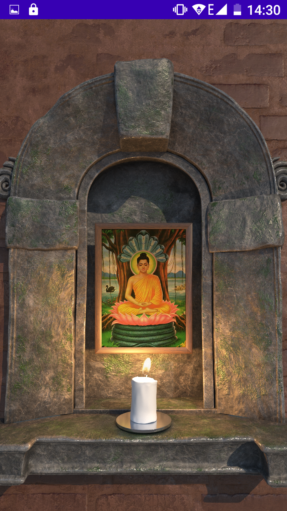

### Candle Shrine
**A devotional ritual app for Android**

Candle Shrine is a casual app to provide moments of spiritual connection via a non-addictive, personalised, devotional ritual with high-quality visual effects.

It lets you build a customised shrine with a devotional image of your choice, then light a candle in front of it with an optional prayer or dedication.

It is built in Kotlin, and uses the following libraries:

[Cookie Cutter](https://github.com/adamstyrc/cookie-cutter)
[Alpha Movie](https://github.com/pavelsemak/alpha-movie)

Kevin Higgins, 19/11/20

